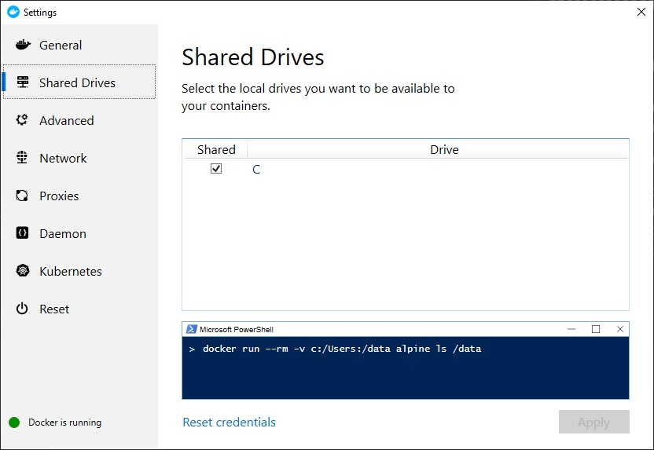

Docker for java developers
=====================

Run oracle db container
-----------------------------------
Share host drive for docker:



Create 2 folders on your host: 
- your_host_docker_data/startup - for save oracle data
- your_host_docker_data/oradata - for initial scripts

Put Init.sql in `your_host_docker_data/startup`.

Note: replace `/\` with `^` and save in bat-file for Windows.

Run script:
```
docker run -d \
  --name docker-rest-db \
  --shm-size=1g \
  -p 1521:1521 \
  -e ORACLE_PWD=password \
  -e ORACLE_PDB=ORCLPDB1 \
  -e ORACLE_CHARACTERSET=AL32UTF8 \
  -v your_host_docker_data/startup:/u01/app/oracle/scripts/startup \
  -v your_host_docker_data/oradata:/u01/app/oracle/oradata \
  daggerok/oracle:11.2.0.2-xe
```

Test connection:
```
jdbc:oracle:thin:@localhost:1521:XE
```

Build appication
-----------------------------------
Download oracle jdbc driver from [official site](https://www.oracle.com/database/technologies/appdev/jdbc-downloads.html), ojdbc8 for example.
Install driver locally:
```
mvn install:install-file -Dfile=path_to_your_file\ojdbc8.jar -DgroupId=com.oracle -DartifactId=ojdbc8 -Dversion=19.7 -Dpackaging=jar
```
Use maven dependency:
```xml
<dependency>
    <groupId>com.oracle</groupId>
    <artifactId>ojdbc8</artifactId>
    <version>19.7</version>
</dependency>
```
Build application:
```
mvn install
```

Build image and run container
-----------------------------------
Build image with name `docker-rest` and tag `1.0` in folder with your Dockerfile:
```
docker build -t docker-rest:1.0 .
```
---
Run container and specify `env` variables `LOG_LEVEL` and `JDBC_URL`. 
Bind inner port 8085 to port 8081 on your host machine:
```
docker run -d \
    --name docker-rest \
    --link docker-rest-db:database \
    -e "LOG_LEVEL=TRACE" \
    -e "JDBC_URL=jdbc:oracle:thin:@database:1521:XE" \
    -v your_host_docker_data/logs:/logs \
    -p 8081:8080 docker-rest:1.0
```